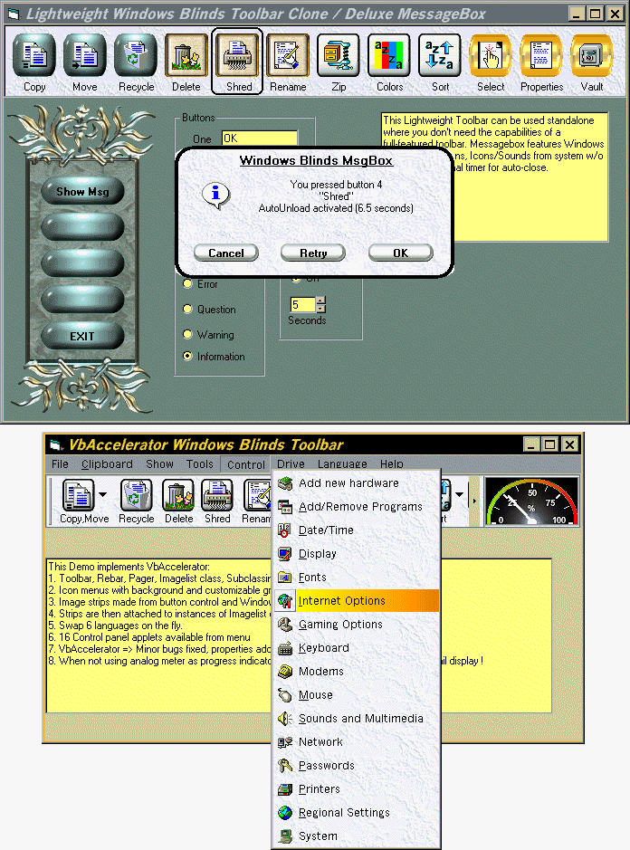



## Windows Blinds Toolbar, VbAccelerator Toolbar

### Description

UPDATED 25-JUNE-2001 -1- Lightweight Windows Blinds Toolbar. Use as is or see VbAccelerator toolbar project below. Button control by J. Pearson (Aug 2000 PSC). Custom message box with Windows Blinds style buttons, optional timer to autoclose box, sounds and icons obtained from system using API.

-2- Full implementation of Windows Blinds style buttons in a professional VbAccelerator Toolbar. Complete with Rebar, Pager, Imagelist class, Dropdown Icon Menu, and SubClass from www.vbaccelerator.com with full source code. Pager control hosts toolbar to allow scrolling when toolbar width exceeds pager width. Menus have Icons, background and customizable gradient highlight. Included in Demo is code to swap languages (currently 6) on the fly using resource file, 16 control panel applets selectable from menu, analog progress meter which can double as a Thumbnail viewer.

-3- Imagestrip builder for making Normal, HOT, and Disabled picture strips to use in VbAccelerator Toolbar project. Put skins in first button, pictures in buttons, run program, save to clipboard, paste to MsPaint, crop, and save image. Strips attach to imagelist class for a low overhead toolbar.

NOTE: Some VbAccelerator code has been modified to fix minor bugs discovered during 8 months of testing. Several new properties and code enhancements added. Uses subclassing so don't use IDE to stop program!
 
### More Info
 

             |
---                |---
**Submitted On**   |2001-06-24 18:43:44
**By**             |[Dana Seaman\_](https://github.com/Planet-Source-Code/PSCIndex/blob/master/ByAuthor/dana-seaman.md)
**Level**          |Advanced
**User Rating**    |4.7 (141 globes from 30 users)
**Compatibility**  |VB 4\.0 \(32\-bit\), VB 5\.0, VB 6\.0
**Category**       |[Custom Controls/ Forms/  Menus](https://github.com/Planet-Source-Code/PSCIndex/blob/master/ByCategory/custom-controls-forms-menus__1-4.md)
**World**          |[Visual Basic](https://github.com/Planet-Source-Code/PSCIndex/blob/master/ByWorld/visual-basic.md)
**Archive File**   |[Windows Bl219026292001\.zip](https://github.com/Planet-Source-Code/dana-seaman-windows-blinds-toolbar-vbaccelerator-toolbar__1-23839/archive/master.zip)

### API Declarations

Too many to list. See code.

